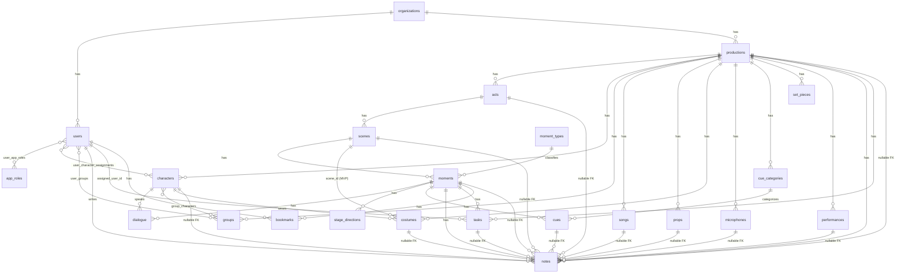

# Entity Relationship Diagram (MVP)

**Version:** 0.1

Mermaid diagram of the MVP PostgreSQL schema. Details: [DATABASE.md](DATABASE.md).

---

## Derived Relationships (not stored)

These are computed from Timeline data, not foreign keys:

* Character → Scene (via dialogue / stage direction references)
* Character → Song (via song attribution / lyric moments)
* Prop → Scene (via future prop events)
* Song → Scene (via moments linked to songs)

---

## Junction Tables

| Table | Joins |
|---|---|
| `user_app_roles` | users ↔ app_roles |
| `user_character_assignments` | users ↔ characters (casting) |
| `group_characters` | groups ↔ characters |
| `user_groups` | groups ↔ users |

---

## MVP Tables Not Shown in Detail

`performances`, `tasks`, `bookmarks`, `set_pieces`, `microphones`, `props` — see [DATABASE.md](DATABASE.md). Included in diagram where they have direct FK relationships.

---

## Post-MVP Additions

* `costume_scenes` join table (multi-scene costumes)
* `preparation_progress` (derived completion tracking)
* Event tables (Phase 3+)
