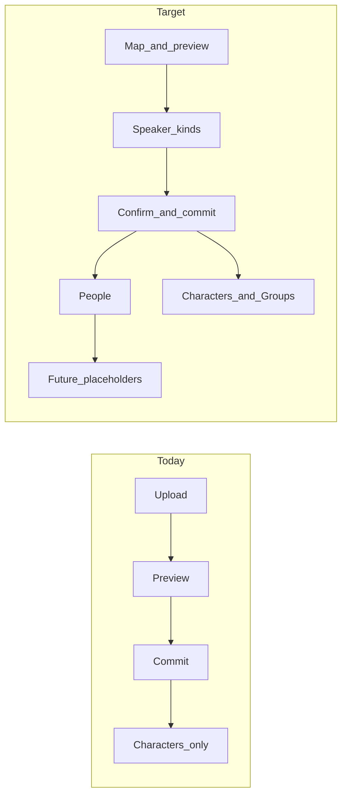

# Group attributions + multi-step import wizard

**Status:** Shipped (2026-09-14) — schema, consumers, multi-step wizard, People step  
**Created:** 2026-09-14  
**Related:** [#130](https://github.com/connorsharpmckinnis/production_app/issues/130), [IMPORTER_2_0.md](IMPORTER_2_0.md), [IMPORT_SPEC.md](IMPORT_SPEC.md), [SCRIPT_FORMAT.md](SCRIPT_FORMAT.md), [DATABASE.md](DATABASE.md), Groups model / blocking pattern

---

## Goal

Extend script import so Moments can be attributed to **Characters and Groups** (including mixed subjects on one Moment), with a human step that classifies each unique speaker label as Character or Group. Refactor the single-page importer into a **multi-step wizard** so rules/preview, speaker-kind decisions, confirm/commit, and people roster each get a focused body — with room for future steps (cue types, entrances/exits).

Success looks like:

- `ALL:` / `ENSEMBLE` (and other labels the admin marks as Group) create **Groups**, not fake Characters
- `VERA & ENSEMBLE` on one Moment links both a Character and a Group
- Timeline, filters, Rehearse “my lines,” and MomentDetail dialogue speaker editing understand Group speakers
- Import is a click-through wizard instead of one crowded page

---

## Why “ship consumers with import”

Import alone is not enough. Today dialogue / lyrics / song attribution only store `character_id`. If import starts writing `group_id` but Timeline, Rehearse, and MomentDetail still assume Character-only rows, Group lines will break or disappear in the app.

**Consumers** = every place that reads or edits those attribution rows after import. This effort includes the minimum set so Group-attributed Moments are usable the day they land:

| Consumer | What changes |
| --- | --- |
| Timeline Moment display | Show Group names next to Character names |
| Character / speaking filters | Expand Group subjects via group membership (same idea as existing `?group_id=` filter) |
| Rehearse “my lines” | Include Moments where the actor’s Characters are members of an attributed Group |
| MomentDetail dialogue speaker | Select Character **or** Group (reuse blocking subject-options pattern where practical); Admin-only script correction also covers lyric / song-attribution multi-select |

Empty Groups (including ALL at import) will not match any actor until membership is filled — that is expected MVP behavior, not a bug.

---

## Problem

1. Scripts use collective labels (`ALL`, `ENSEMBLE`, later company/chorus-style names). Storing them as Characters is a leaky abstraction (not castable roles; catalog APIs already hide builtins).
2. Multi-speaker Moments already allow multiple **Characters**; they cannot mix in a **Group**.
3. Import creates Characters automatically from speaker strings with no human classification step.
4. ImportPage packs profile rules, preview, and commit into one screen; adding speaker-kind UI (and later people / cues / E/E) will not fit cleanly.

---

## Locked decisions

| Topic | Decision |
| --- | --- |
| ALL | Normal **empty Group** at import. Membership (“everyone may belong”) is a later problem — not auto-filled here. |
| ENSEMBLE (and other recommended labels) | Same: empty Group unless the user marks the label as Character. |
| Confirm before commit | Separate wizard step: review counts, then commit. Do not commit when leaving the speaker-kind step. |
| Consumers | Same effort as import (see table above). |
| People step source | Reuse **People** page add-member APIs/flow (Overview roster is read-only + link today). |
| Attribution schema | Nullable `group_id` on `dialogue`, `lyric_lines`, `song_attribution_characters`; XOR CHECK: exactly one of `character_id` \| `group_id` (same pattern as `moment_blocking`). |
| Mixed subjects | One join row per subject; same text on each row (today’s multi-Character pattern, extended). |
| Recommend-as-Group defaults | Case-insensitive: `All`, `Ensemble`. Keep the list small; do **not** auto-recommend `Chorus` until SCRIPT_FORMAT clarifies collision with song-section markers. |
| Commit boundary | Steps 1–2 dry-run only; commit on confirm step; People is **post-commit**. |
| Import paths | Legacy (`importer.py`) and profile (`mapped_importer.py`) both accept a `speaker_kinds` map on commit. |

---

## Current grounding

- Import UI: one page — [frontend/src/pages/ImportPage.tsx](../frontend/src/pages/ImportPage.tsx)
- Speakers → Characters only; builtins in [backend/app/services/importer/builtins.py](../backend/app/services/importer/builtins.py)
- Groups exist for membership, blocking, and timeline filter expansion — **not** for dialogue/lyrics
- People add flow: People page / `api/people.py`, not Overview

---

## Wizard steps

| Step | Body | Gate |
| --- | --- | --- |
| 1. Map & preview | Upload, profile/rules, preview (current importer 2.0 UI) | Preview OK (profile) or file ready (legacy) |
| 2. Characters & Groups | Unique speaker labels; Character \| Group toggle; occurrence counts; auto-recommend All / Ensemble | Every label classified |
| 3. Confirm & import | Summary counts (acts/scenes/moments/characters/groups) → commit | Import succeeds |
| 4. People | Add existing org users to the production (candidates + add member) | Skip or Finish |

Future wizard steps (cue types, entrances/exits, etc.) stay docs-only — not shown as disabled UI placeholders.

Wizard state stays in the browser (file bytes, profile, preview, kind map) so Back does not re-upload. No server-side draft import session in this slice.

---

## Work packages

### WP0 — Schema + attribution model

- Alembic: make `character_id` nullable on `dialogue`, `lyric_lines`, `song_attribution_characters`; add `group_id`; XOR CHECK; adjust unique indexes (mirror blocking).
- Data migration: existing Character `ALL` / `ENSEMBLE` → Groups of the same name; remap join rows; remove fake Characters (or leave unused and stop creating them).
- API / Pydantic: responses expose subject as character or group (e.g. `subject_type` + ids/names).
- New imports stop seeding builtin Characters; builtins become **recommend-as-Group** hints only.

**Done when:** DB and API accept Character-only, Group-only, and mixed multi-subject Moments; existing ALL/ENSEMBLE remapped.

### WP1 — Consumers (same effort)

- Timeline display labels
- Speaking filters / `speaking_character_ids` expansion via group membership
- Rehearse “my lines” for group members
- MomentDetail dialogue speaker picker (Character + Group)
- Remove catalog special-casing for ALL/ENSEMBLE Characters once they are Groups
- Light audit of reports / readiness / lav for hard `character_id`-only assumptions; fix only what breaks

**Done when:** A Moment with `ENSEMBLE` (Group) + `VERA` (Character) renders, filters, and edits correctly.

**Defer:** segment-accurate parenthetical ownership (#59).

**Follow-up shipped 2026-09-14:** Admin Moment Detail can replace-set dialogue / lyric / song-attribution subjects (Character + Group multi-select), edit shared dialogue/lyric text, and add a speaker/singer when a Moment has none.

### WP2 — Wizard shell

- Refactor ImportPage into stepped layout (table above).
- Keep already-imported / success / error as terminal or overlay states.
- Step 1 behavior matches current importer 2.0 until WP3 wires kinds.

**Done when:** Admin can click through steps 1→4 on a throwaway production; body shows one concern at a time.

### WP3 — Speaker kinds + commit

1. Collect unique speaker labels from preview / classify output (dialogue, lyric, song_attribution).
2. Step 2 UI: per-label Character | Group; occurrence count; recommend All / Ensemble as Group.
3. Commit payload: `speaker_kinds: { "ALL": "group", "VERA": "character", ... }`.
4. Persist: create/find Character or Group by name; write the correct join row type per subject; mixed labels → mixed rows.
5. Wizard always sends a full map; API may default omitted map for tests (ALL/ENSEMBLE → group, else character).

**Done when:** Fixture / Scrooge-like import creates an Ensemble **Group** when classified as Group; mixed Moments persist correctly on both legacy and profile paths.

### WP4 — Post-import People step

- After commit: `GET .../people/candidates`, `POST .../people` (same as People page).
- Skip allowed; Finish → Timeline / Overview.
- Does **not** cast Characters or fill Group membership (link out to Groups / Characters).

**Done when:** Admin can add at least one existing user during the finish flow without leaving the wizard.

### WP5 — Docs & closeout

- Update DATABASE.md, IMPORT_SPEC.md, SCRIPT_FORMAT.md; point IMPORTER_2_0.md deferred #130 at this doc / shipped status.
- FEATURE_CLOSEOUT when the authorized slice ships; close or update #130.

---

## Explicitly out of scope

- Auto-membership for ALL (“every Character”) or Ensemble (inferred cast)
- Filling Group membership or casting during import
- Re-import / revision merge
- Example-driven rule builder (IMPORTER_2_0 §17)
- Cue type / entrance-exit import (wizard placeholders only)
- OCR / Fountain / Final Draft

---

## Risks

- **Empty Groups + “my lines”:** actors won’t see collective lines until membership is set — document after import.
- **CHORUS collision:** song section marker vs Group name — keep recommend list small.
- **Migration:** productions already using Character ALL/ENSEMBLE need remap; test on seeded + pilot DBs.
- **Schema:** XOR on existing tables is the smallest change (matches blocking). A unified `moment_speakers` table is cleaner long-term but larger — defer.

---

## Suggested build sequence

1. WP0 schema + migration  
2. WP1 consumers  
3. WP2 wizard shell (Step 1 = current behavior)  
4. WP3 speaker kinds + commit  
5. WP4 people step  
6. WP5 docs / #130 closeout  

---

## Done when

- Import wizard classifies speakers as Character or Group and creates both entity types
- Moments can attribute dialogue / lyrics / song performers to Characters, Groups, or a mix
- Timeline / Rehearse / MomentDetail dialogue editing work with Group subjects
- ALL / ENSEMBLE are Groups (empty at import), not castable Characters
- Post-import People step can add production members

---

## Authorization

Shipped 2026-09-14 (schema, consumers, multi-step wizard, People step, docs). Owner can close #130 after a real import smoke test. Follow-ups: auto-membership for ALL, Group membership during import; future wizard steps (cues / E/E) are docs-only until built.
